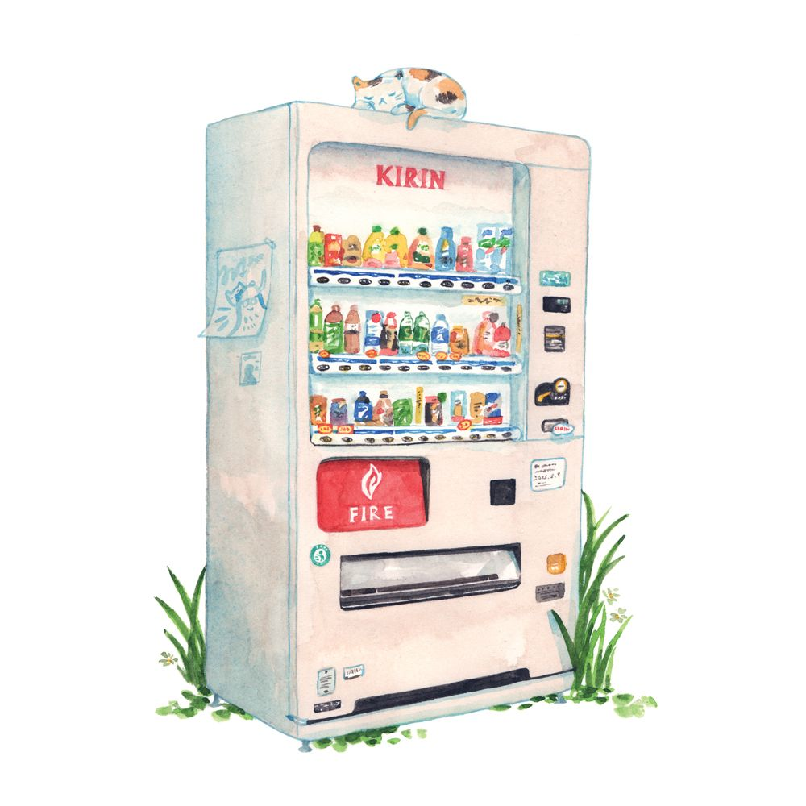

# VENDING MACHINE PROJECT

<div align="center">

</div>

## About project

This repositorie is dedicated to 1DAW 2nd trimester project. We are going to simulate a vending machine. The program will cover basic operations like buying, machine money, restock (money and products)

## Modules

We will work with a simple modules structure. The program will be corrected with [pycheck](https://pycheck.es/), a tool designed by [our teacher](https://github.com/sdelquin):

```
├── vending.py
├── expected.txt
├── status.dat
├── operations.dat
```

- vending.py: It is the main program where all the operations will be done. In this case, for the evaluation, the result will be given with a text file and the final status of the machine will be written in an output file
- operations.dat: It is the file where the teacher will give the operations to be made on the machine. Every line will be a different operation.
- expected.txt: It is the file with the expected final result to compare the program result and check if it's working correctly.
- status.dat: It is the file to be written when all operations have been completed. Then, [pycheck](https://pycheck.es/) will check if it matches with expected.txt

### Implementation information

| Código | Description                                                  | Arguments                                                                |Example      |                                                                                                                                                |
| ------ | -------------------------------------------------------------- | ------------------------------------------------------------------------- | ------------ | --------------------------------------------------------------------------------------------------------------------------------------------------------------------- |
| `O`    | Make an order <br>(**O**rder)                                | - Product code.<br>- Requested amount<br>- Paid money. | `O F19 4 10` | 
| `R`    | Restock a product <br>(**R**estock product)                | - Product code.<br>- Restocked amount                            | `R D12 7`    |
| `P`    | Change product price<br>(change product **P**rice) | - Product code.<br>- New price                    | `P F10 3`    |                                                                                                                               |
| `M`    | Money restock <br>(restock **M**oney)                         | - Money amount                                                     | `M 20`       |

\* If the product not exist at the moment of restock it will be added with price 0.

## Output 
The program, at the moment of write the final result or stauts, in first line it will return the amount of money (coins) on the machine, and then in every line a product followed by the stock and the price after all the modifications. An example:  
```
99
D12 47 1
D31 16 5
F10 24 2
F19 29 3
```

## References

- [Teacher's repo](https://github.com/sdelquin/pro/blob/main/ut4/te1/README.md)